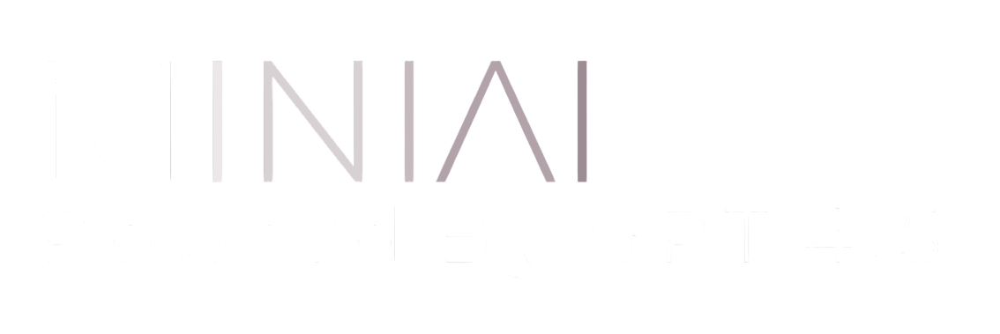
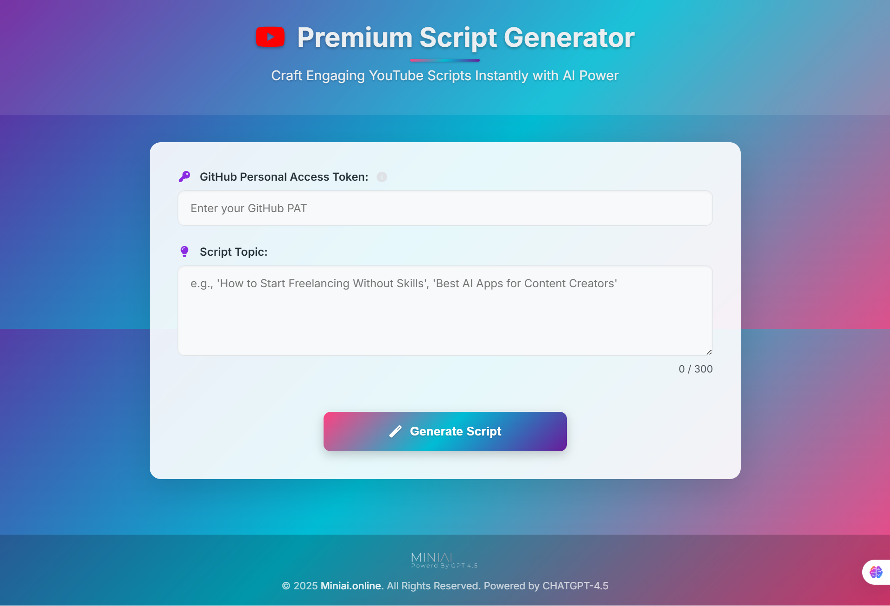

#  Premium YouTube Script Generator 

Generate engaging, SEO-optimized YouTube scripts effortlessly using the power of advanced AI, tailored to a personal, motivational, and relatable style!



## ✨ Features

*    **AI-Powered Script Generation:** Leverages cutting-edge AI to create unique scripts based on your topic.
*    **Customizable Tone:** Generates scripts in a personal, desi, motivational, and slightly raw style.
*    **Engaging Structure:** Follows a proven Hook → Intro → Content Body → CTA → Motivation structure.
*    **Built-in Checklist:** Ensures key elements like hooks, examples, and CTAs are included.
*    **Vibrant & Responsive UI:** Modern, full-width design that looks great on all devices.
*    **Markdown Formatting:** Displays generated scripts with clear headings, lists, and emphasis.
*    **Export to DOCX:** Easily download your formatted script as a `.docx` file.
*    **Copy Raw Script:** Copy the original Markdown text to your clipboard.

## 🛠️ Tech Stack

*   **Frontend:** HTML5, CSS3, Vanilla JavaScript
*   **Backend:** Node.js, Express.js
*   **AI Model:** Accessed via GitHub Models endpoint (e.g., GPT-4.1 / 4.5) using `@azure/ai-inference`
*   **Markdown Rendering:** Marked.js
*   **DOCX Export:** html-to-docx-buffer, FileSaver.js
*   **Icons:** Font Awesome

## 🚀 How to Use

Follow these steps to set up and run the script generator locally:

1.  **Clone the Repository:**
    ```bash
    git clone https://github.com/your-username/your-repo-name.git # Replace with your actual repo URL
    cd your-repo-name
    ```

2.  **Install Dependencies:**
    You need Node.js and npm installed. Run the following command in the project directory:
    ```bash
    npm install
    ```

3.  **Get Your GitHub Personal Access Token (PAT):**
    *   The script generator requires a GitHub PAT to authenticate with the AI model endpoint provided by GitHub.
    *   **How to find/create a PAT:**
        *   Go to your GitHub **Settings**.
        *   Navigate to **Developer settings** in the left sidebar.
        *   Click on **Personal access tokens** > **Tokens (classic)**.
        *   Click **Generate new token** > **Generate new token (classic)**.
        *   Give your token a descriptive **Note** (e.g., "YouTube Script Generator").
        *   Set an **Expiration** period (recommended for security).
        *   Under **Select scopes**, make sure to check the **`read:public_key`** scope (or potentially other scopes required by the specific GitHub Models API you are using - consult their documentation if unsure). **Do not grant excessive permissions.**
        *   Click **Generate token**.
        *   **🚨 Important:** Copy your new PAT immediately. You won't be able to see it again! Store it securely.
    *   For more detailed instructions, visit the official GitHub documentation: [Creating a personal access token](https://docs.github.com/en/authentication/keeping-your-account-and-data-secure/managing-your-personal-access-tokens#creating-a-personal-access-token-classic)

4.  **Set Environment Variable:**
    *   You need to set your PAT as an environment variable named `GITHUB_TOKEN` before running the server. **Do not hardcode it in the source code.**
    *   **Linux/macOS:**
        ```bash
        export GITHUB_TOKEN="your_actual_pat_here"
        ```
    *   **Windows (Command Prompt):**
        ```bash
        set GITHUB_TOKEN=your_actual_pat_here
        ```
    *   **Windows (PowerShell):**
        ```powershell
        $env:GITHUB_TOKEN="your_actual_pat_here"
        ```
    *   *Replace `your_actual_pat_here` with the actual PAT you copied.*

5.  **Run the Server:**
    Make sure you are in the project's root directory and have set the environment variable in the *same terminal session*.
    ```bash
    node server.js
    ```
    You should see output like `Server running at http://localhost:3000`.

6.  **Access the App:**
    Open your web browser and navigate to:
    [http://localhost:3000](http://localhost:3000)

7.  **Generate Scripts!**
    Enter your desired script topic and click "Generate Script".

## 🔒 Security Note

*   Your GitHub Personal Access Token (PAT) is sensitive. Keep it secure and **never** commit it directly into your source code or share it publicly.
*   Using environment variables (as implemented in `server.js`) is the recommended way to handle such secrets.
*   Grant only the minimum necessary scopes to your PAT.

## 🤝 Contributing (Optional)

Contributions, issues, and feature requests are welcome! Feel free to check [issues page](https://github.com/your-username/your-repo-name/issues).

## 📄 License (Optional)

This project is licensed under the MIT License - see the LICENSE.md file for details.
*(You'll need to create a LICENSE.md file, typically containing the MIT License text if you choose MIT)* 